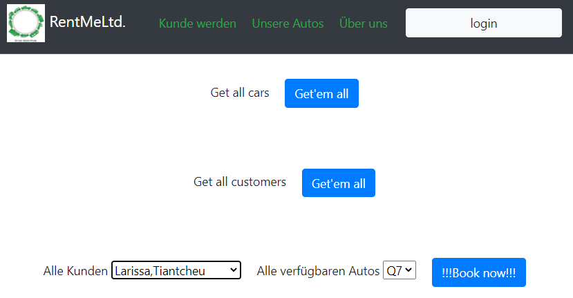
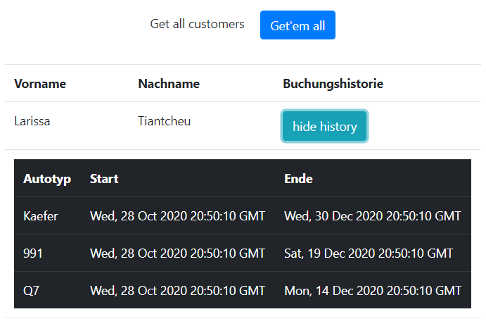
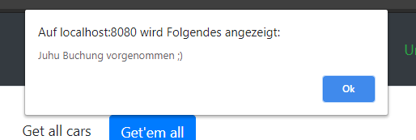

= Team 5
:toc-title: Inhaltsverzeichnis
:toclevels: 4
:toc:
:author: Tiantcheu Larissa <s0561829@htw-berlin.de>
:author: Ostrzinski Christoph <s0568880@htw-berlin.de>
:author: Matthias Kronenberg <s0571096@htw-berlin.de>

== Lecture Sheet 7

Wir haben einen AWS S3 Bucket angelegt und diesen per AWS cloudfront mit Routen verknüpft. Über die entsprechende Adresse kann das Frontend jetzt aufgerufen werden.

== Lecture Sheet 5 + 6

=== Migration

Wir haben für jedes unserer Objekte (Bookings, Cars, Customers) eine Lambda Funktion erstellt. Innerhalb der Lambda Funktion stellen wir
zuerst eine Verbindung zur DynamoDB her. Danach greifen wir auf den Request Body zu und werten aus, welche Methode angesprochen
werden soll. 

Für die Logik der Methoden konnten wir uns weitgehend an unserer bisherigen DAO Klasse orientieren. Zurückgegeben wird JSON mit einem Statuscode
und den Rückgabewerten im Body.

=== DynamoDB

Innerhalb der DynamoDB haben wir 3 Tabellen für die Bookings, die Cars und die Customers erstellt. Die Struktur unserer bisherigen MongoDB
konnten wir auch hier weitgehend übernehmen.

=== API Gateway

Dnach haben wir ein API Gateway erstellt und unsere Routen definiert und mit den Lambda Funktionen verknüpft.

Aus unserem Frontend können wir nun auf die API zugreifen.

== Lecture Sheet 4

=== MongoDB

Zwei neue Services wurden hinzugefügt. Eine no sql mongoDB persistenten Speichern und Abrufen der Daten und MongoExpress
als visuelle Oberfläche, damit die Daten besser eingesehen werden können.

Die Datenbank und die Oberfläche wurden dem erstellten Netzwerk hinzugefügt und laufen neben den anderen Docker
Containern.

=== Änderungen Backend

Sämtliche Kommunikation bezüglich Daten werden in die Datenbank geschrieben und über sie abgerufen. Die Schnittstellen
auf dem Backendserver wurden angepasst. Eine `DAO-Klasse` (DataAccessObject) für die Kommunikation mit der Datenbank wurde erstellt.

Um einen datenbanks `join` zu simmulieren wurde ein `DTO` (DataTransferObject) erstellt, dass die Informationen aus der Booking, Car und
Customertabelle vereint.

=== Änderungen Frontend

Da die Änderungen nur das Backend betroffen haben, hat sich im Frontend nichts geändert.

== Lecture Sheet 3

=== Einsatz von Docker

==== Webapp

Durch das Bauen des Dockerimages ("./webapp/dockerfile") werden alle Inhalte aus dem Content-Ordner
("./webapp/content/") in den Ordner ("/usr/share/nginx/html") des nginx Dockers kopiert, der beim Aufrufen über das
Webfrontend aufgerufen wird.

Für das Interagieren mit anderen Containern müssen die Configurationen überschrieben werden.
Hierzu wird wenn der Container gebaut wird alles was im Ordner ("./webapp/config") liegt in den nginx-Config-Ordner
("/etc/nginx/conf.d/default.conf") verschoben und überschreibt die dort liegenden "default.conf"-Datei.

In der Config Datei ist ein Proxy hinterlegt der es dem nginx anweist den Path "/api/" auf den Backend-Container zu
mappen.

==== Backend

Das Backend wurde für eine bessere Unterscheidung auf den Port 4000 gemapped.

==== Docker-Compose

Ab dieser Version wird eine Docker-Compose Datei mitgeliefert. Diese erlaub es die jeweiligen Docker gezielt und immer
auf gleiche Weise hochzufahren und erstellt außerdem ein Netzwerk in dem die Container sich austauschen können.

Aus Bequemlichkeit wird beim Hochfahren des Web-Dockers ein Volume-Mounting durchgeführt, welches erlaubt Änderungen am
Forntend vorzunehmen ohne notwendigerweise das Image neu erstellen zu müssen.

=== HTML Frontend

 Zum Anzeigen aller Daten wird die "index.html" verwendet. Hierbei dient die oberste Leiste nur der Verschönerung und ist mit keinerlei Funktion versehen

[#totalView]
.Überblick über die Seite

Zum Laden und Einfügen der Daten und der
Interaktion zwischen Mensch und Server implementiert die "index.html" die "js/script.js"-Datei. Nach dem Laden der Seite
werden alle freien Autos und alle Kunden geladen und in das Dropdown geladen. Dies verhindert eine fehlerhafte Eingabe.

Beim Drücken eines Buttons wird jeweils die notwendige Request an den Backendserver gesendet und jeweiligen Daten aus
der json-Antworten eingelesen und als Tabelle angezeigt.

[#listView]
.Ansicht der Daten als Liste

Die Jeweilige Buchungshistorie eines einzelnen Kunden ist nach dem Anzeigen aller Kunden über einen Button der neben
dem jeweiligen Namen erscheint.

Das Erfolgreiche Buchen eines Autos wird mit einem Popup bestätigt.
[#popup]
.Popupansicht

== Lecture Sheet 2

=== Vor- und Nachteile von Docker

Mit Docker wir Flask automatisch installiert.
Das Betriebssystem im Hintergrund ist bei allen Teammitgliedern das gleiche.
Dadurch können beispielsweise keine Probleme durch Betriebssystemspezifische Pfadangaben enstehen.

=== Setup ohne Docker

An unserem Setup hätte sich ohne Docker bisher nichts geändert.

=== Dokumentation

Wir haben 4 HTTP Endpoints in Flask festgelegt.

Da Flask zustandlos ist, muss bei jedem weiteren Aufrufen eines Endpoints die JSON Datei erneut eingelesen werden.
Mithilfe der JSON Testdaten versuchen wir jedem Kunden ein Auto zuzuordnen, solange es noch nicht vergeben ist.

==== /customers & /cars

Mit den Endpoints "/customer" und "/cars" werden alle im System vorhandenen Kunden und Autos ausgegeben.
Dazu mussten wir die Liste mit dem __dict__ Attribut aufrufen und mit einer Schleife durchlaufen.
Der Output wurde dann per jsonify geparst und ausgegeben.

==== /customer/<first_name>/<last_name>/book/<car_id>

Beim Endpoint /customer/<first_name>/<last_name>/book/<car_id> nehmen wir die car_id und gehen alle 5 Autonamen durch und versuchen, das passende Auto zu finden.
Das Auto wird, falls es nicht bereits gebucht ist, auf den angegebene Namen gebucht.

==== /customer/<first_name>/<last_name>/history

Beim Endpoint /customer/<first_name>/<last_name>/history durchlaufen wir die customers in unseren JSON Testdaten und geben dann per jsonify die passende Buchungshistorie aus.

....

{
  "data": {
    "cars": [
      {
        "name": "Kaefer",
        "number_of_seats": 4,
        "color": "yellow",
        "brand": "VW",
        "is_booked": false
      },
      {
        "name": "991",
        "number_of_seats": 4,
        "color": "red",
        "brand": "Porsche",
        "is_booked": false
      },
      {
        "name": "AMG",
        "number_of_seats": 5,
        "color": "white",
        "brand": "Mercedes",
        "is_booked": false
      },
      {
        "name": "Q7",
        "number_of_seats": 5,
        "color": "black",
        "brand": "AUDI",
        "is_booked": false
      },
      {
        "name": "i7",
        "number_of_seats": 2,
        "color": "blue",
        "brand": "BMW",
        "is_booked": false
      }
    ]
  },
  "customers": [
    {
      "first_name": "Larissa",
      "last_name": "Tiantcheu"
    },
    {
      "first_name": "Christoph",
      "last_name": "Ostrzinski"
    },
    {
      "first_name": "Matthias",
      "last_name": "Kronenberg"
    }
  ]
}
....

== Lecture Sheet 1

=== Aufgabe 1 - List of requirements

* 4 Gruppen angelegt Car, Customer, Booking, BookingList
* Car: name, color, number_of_seats, brand
* Customer: first_name, last_name
* Booking: car, customer, start, end
* BookingList: bookings <- muss checken, ob car bereits gebucht (bisher nur anhand des Namens)

=== Aufgabe 2 - Coding

* Pro Gruppe aus den Requirements haben wir eine Classe und die dazugehörigen Attribute angelegt
* Ein grundlegende Projektstruktur wurde erstellt
* Für jede Klasse wurde eine "to_json"-Methode implementiert um das spätere Interagieren mit dem Server zu erleichtern

=== Aufgabe 3 - Testdata

* In einer gesonderten Datei (.car-data.json) haben wir Testdaten hinterlegt.
* Über die Main Methode haben wir die Daten eingelesen.
** Als erstes werden gemäß der Testdaten-Datei die Car-Objekte erzeugt.
** Als zweites werden gemäß der Testdaten-Datei die Customer-Objekte erzeugt.
** Jedem Customer wird ein zufälliges Auto zugewiesen.
*** dies geschieht über das Erstellen eines Booking-Objektes
** Anschließend wird das Booking-Objekt der Liste hinzugefügt
*** dabei wird überprüft, ob das Auto bereits vermietet wurde
* Ein Test, ob das Doppelte Vermieten eines Autos möglich ist, wurde hinzugefügt